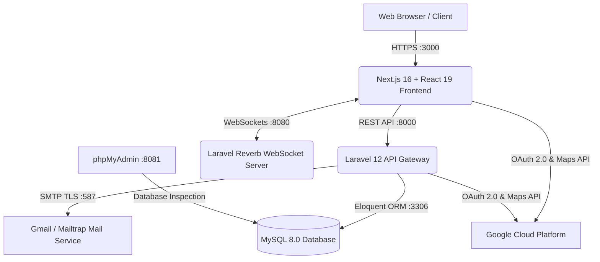

<div align="center">

<p align="center">
  
</p>

### *Comprehensive Charity Event & Volunteer Management System for NGOs in Malaysia*

Empowering NGOs in Malaysia to organize charity events efficiently — manage volunteers, shifts, capacities, QR check-ins, and auto-generate participation certificates, all in one modern platform.

[](https://nextjs.org/)
[](https://react.dev/)
[](https://laravel.com/)
[](https://tailwindcss.com/)
[](https://www.mysql.com/)
[](https://www.docker.com/)
[](https://opensource.org/licenses/MIT)

[Features](#-key-features) • [User Guide](#-how-to-use-walkthrough) • [API Credentials Guide](#-api-keys--credentials-setup-guide) • [Docker Quickstart](#-quickstart-with-docker-recommended) • [Manual Setup](#-manual-installation-without-docker) • [Demo Accounts](#-default-test-accounts-seeders)

</div>

---

## 📖 Overview

**CharityStride** is an all-in-one web-based event and volunteer management platform specifically crafted to empower **Non-Governmental Organizations (NGOs)** and charity communities in Malaysia.

It eliminates operational hurdles by delivering:
- Dynamic volunteer shift allocation and real-time capacity control.
- Seamless participant ticketing and transparent donation fundraising tracking.
- Real-time on-site verification using **instant QR code scanning** for attendance check-in, check-out, and merchandise (T-shirt) collection.
- Automated generation of **Official Digital Participation Certificates (PDF)** with verifiable authenticity.
- Zero-latency, live UI synchronization powered by **Laravel Reverb (WebSockets)**.

---

## 🧩 Key Features

| Feature | Description |
| :--- | :--- |
| 👥 **Volunteer & Shift Management** | NGOs can configure specific volunteer roles (e.g., Medical, Marshal, Registration), multiple time shifts, and set maximum volunteer capacity with automatic threshold locks. |
| 📱 **QR Code Check-in System** | Volunteers and event participants receive unique QR code passes for fast on-site verification, attendance logging, and T-shirt redemption. |
| 📜 **Automated Digital Certificates** | Verified attendees and completed-shift volunteers can instantly view and download official digital participation certificates formatted in high-resolution PDF. |
| 🗺️ **Interactive Geo-Location Mapping** | Integrated **Google Maps & Leaflet** allows event organizers to pinpoint exact venue coordinates and gives participants one-click navigation directions. |
| ⚡ **Real-time Live Broadcasting** | Powered by **Laravel Reverb** to deliver instant updates on volunteer slots, shift availability, and event announcements without manual page refreshes. |
| 🔐 **3-Tier Role-Based Access Control** | Dedicated portals with fine-grained permissions for **Super Admin**, **NGO Organizers**, and **Volunteers/Donors**, secured via Laravel Sanctum, Google OAuth 2.0, and email TAC verification. |
| 📊 **Advanced Analytics & Reporting** | Visual data dashboards (Recharts) covering volunteer turnout rates, event performance, donation breakdowns, and platform-wide revenue reports. |

---

## 🏗️ System Architecture



---

## 📱 How to Use (Walkthrough)

CharityStride provides three specialized portals tailored to user roles:

### 1. As a Volunteer / Participant (User Portal)
1. **Sign Up / Log In**:
   - Navigate to `http://localhost:3000/login` or register a new account. You can also sign in with a single click using **Google One-Tap OAuth**.
2. **Discover Charity Events**:
   - Browse the public events directory to explore active causes, view venue locations on interactive maps, and inspect volunteer slot requirements.
3. **Register for an Event**:
   - Choose your registration type:
     - **Volunteer**: Select your preferred role (e.g., *Water Station*, *Marshal*, *Registration Desk*) and choose an available time shift.
     - **Participant**: Select category/tier (e.g., *5KM Fun Run*, *10KM Charity Walk*).
     - **Donor**: Make direct charitable monetary donations.
4. **Access Your Digital QR Pass**:
   - After registering, visit **Dashboard > My Registrations**. Your personal QR code ticket will be generated immediately.
5. **Event Day Check-In**:
   - Present your QR pass to the NGO staff at the event venue for instant scanning (*Check-In*, *Check-Out*, and *T-shirt collection*).
6. **Download Certificate**:
   - Once your attendance is verified and the event concludes, go to **My Certificates** to download your personalized digital certificate.

---

### 2. As an Event Organizer (NGO Portal)
1. **Apply for NGO Status**:
   - Log in and submit an NGO profile application with organization details (Registrar of Societies / ROS registration number, official address, and bank account info).
   - Await approval from the Super Admin.
2. **Create a Charity Event**:
   - Open the NGO dashboard (`/ngo/events`) and click **Create Event**.
   - Fill in event specifics, upload marketing banners, and set the physical venue using the **Google Maps Location Picker**.
3. **Configure Volunteer Roles & Shifts**:
   - Add specialized volunteer positions, define shift start/end times, and set maximum capacity limits per slot.
4. **On-Site QR Scanner**:
   - On event day, navigate to **Registration Management > Scan QR**.
   - Use your device's camera to scan attendees' QR tickets for real-time *Check-In*, *Check-Out*, or *T-Shirt Distribution*.
5. **Review Event Insights & Reports**:
   - Track live turnout percentages, volunteer attendance metrics, and export data summaries.

---

### 3. As a System Administrator (Super Admin Portal)
1. **Admin Dashboard Access**:
   - Log in with administrator credentials at `/login` (automatically redirected to `/admin/dashboard`).
2. **NGO Verification & Compliance**:
   - Review pending NGO registration submissions under **NGO Management**. Inspect uploaded documentation and choose to **Approve** or **Reject**.
3. **Event Moderation**:
   - Audit events submitted for publishing by NGOs before they go live to ensure community safety and legitimacy. Take down non-compliant events when necessary.
4. **Platform Analytics & Reports**:
   - Generate platform-wide financial overviews, charity donation distributions, and volunteer engagement statistics across Malaysia.

---

## 🔑 API Keys & Credentials Setup Guide

CharityStride integrates with external services for authentication, location mapping, email notifications, and real-time updates. Follow this guide to configure your keys:

### 1. Google OAuth 2.0 (Google Sign-In)
Used for one-click Google authentication on both Frontend and Backend.

1. Open the [Google Cloud Console](https://console.cloud.google.com/).
2. Create a new project (e.g., `CharityStride`).
3. In the sidebar, navigate to **APIs & Services** > **OAuth consent screen**:
   - Select User Type: **External** and click **Create**.
   - Enter your App name (`CharityStride`), user support email, and developer contact email.
   - Click **Save and Continue** through the steps (add your test email under *Test Users* if prompted).
4. Go to **APIs & Services** > **Credentials**:
   - Click **+ CREATE CREDENTIALS** > select **OAuth client ID**.
   - Choose Application type: **Web application**.
   - Set Name: `CharityStride Web Client`.
   - Under **Authorized JavaScript origins**, add:
     ```text
     http://localhost:3000
     http://localhost:8000
     ```
   - Under **Authorized redirect URIs**, add:
     ```text
     http://localhost:8000/api/auth/google/callback
     http://localhost:3000
     ```
   - Click **Create**.
5. Copy your credentials:
   - **Client ID** $\rightarrow$ assign to `NEXT_PUBLIC_GOOGLE_CLIENT_ID` in Frontend and `GOOGLE_CLIENT_ID` in Backend.
   - **Client Secret** $\rightarrow$ assign to `GOOGLE_CLIENT_SECRET` in Backend.

---

### 2. Google Maps JavaScript API (Interactive Event Map)
Used by the `LocationPicker` component to search venue locations, pick GPS latitude/longitude coordinates, and display maps.

1. In your [Google Cloud Console](https://console.cloud.google.com/) project:
2. Navigate to **APIs & Services** > **Library**.
3. Search for and **Enable** the following two APIs:
   - ✅ **Maps JavaScript API**
   - ✅ **Places API (New)**
4. Navigate to **APIs & Services** > **Credentials**:
   - Click **+ CREATE CREDENTIALS** > select **API key**.
   - Your API key will be generated (e.g., `AIzaSy...`).
5. *(Recommended)* Click **Edit API Key** under **API restrictions**, select *Restrict key*, and check only **Maps JavaScript API** and **Places API**.
6. Copy the API Key $\rightarrow$ paste into `NEXT_PUBLIC_GOOGLE_MAPS_API_KEY` in `frontend/.env.local`.

---

### 3. SMTP Email / Gmail App Password (TAC Codes & Notifications)
Used by Laravel backend to dispatch password-reset verification TAC codes and registration emails.

#### Option A: Using Gmail (Recommended for Real Testing)
1. Go to [Google Account Security](https://myaccount.google.com/security).
2. Ensure **2-Step Verification** is turned **ON**.
3. Navigate to **App passwords** (or visit [Google App Passwords](https://myaccount.google.com/apppasswords)).
4. Enter an app name (e.g., `CharityStride`) and click **Create**.
5. Google will display a 16-character password (e.g., `abcd efgh ijkl mnop`).
6. Update your backend `.env` file:
   ```env
   MAIL_MAILER=smtp
   MAIL_HOST=smtp.gmail.com
   MAIL_PORT=587
   MAIL_USERNAME=your_email@gmail.com
   MAIL_PASSWORD=your_16_character_app_password_without_spaces
   MAIL_ENCRYPTION=tls
   MAIL_FROM_ADDRESS="your_email@gmail.com"
   MAIL_FROM_NAME="CharityStride"
   ```

#### Option B: Using Mailtrap (Free Sandbox for Local Development)
1. Create a free account at [Mailtrap.io](https://mailtrap.io/).
2. Navigate to **Email Testing** > **Inboxes** > select the *Laravel 9+* configuration template.
3. Copy the host, port, username, and password directly into your backend `.env` file.

---

### 4. Laravel Reverb (Real-time WebSockets)
> [!TIP]
> **No external paid subscription required!** Laravel Reverb is a high-speed, self-hosted WebSocket server that runs locally out of the box.

The default configuration is pre-configured across the stack:
```env
REVERB_APP_ID=charitystride_app
REVERB_APP_KEY=charitystride_key
REVERB_APP_SECRET=charitystride_secret
REVERB_HOST="localhost"
REVERB_PORT=8080
REVERB_SCHEME=http
```

---

## 🐳 Quickstart with Docker (Recommended)

This repository includes a production-grade multi-container **Docker Compose** environment that runs Next.js Frontend, Laravel 12 Backend, MySQL 8.0, and phpMyAdmin with a single command.

### Prerequisites
- Install and launch [Docker Desktop](https://www.docker.com/products/docker-desktop/).

### Step-by-Step Installation:

#### 1. Clone the Repository
```bash
git clone https://github.com/AzimAminz/CharityStride.git
cd CharityStride
```

#### 2. Prepare Environment Files
Copy the template configuration files for both services:

```bash
# Backend Environment
cp backend/.env.example backend/.env

# Frontend Environment
cp frontend/.env.example frontend/.env.local
```
*(Open `frontend/.env.local` to input your Google Client ID and Google Maps API Key if testing maps and Google login).*

#### 3. Build & Start the Docker Containers
Run from the root directory of the project:

```bash
docker compose up -d --build
```

#### 4. Run Database Migrations & Seeders
Once all containers report healthy, seed the database with initial schemas and demo accounts:

```bash
docker compose exec backend php artisan migrate:fresh --seed
```

#### 5. Access the Services
Open your web browser and navigate to:

| Service | URL | Description |
| :--- | :--- | :--- |
| 🌐 **Frontend (Next.js)** | [http://localhost:3000](http://localhost:3000) | Public portal, Volunteer & NGO Dashboards |
| ⚙️ **Backend API (Laravel)** | [http://localhost:8000](http://localhost:8000) | CharityStride REST API Gateway |
| 📡 **Laravel Reverb (WebSocket)** | [ws://localhost:8080](http://localhost:8080) | Live event broadcasting server |
| 🗄️ **phpMyAdmin** | [http://localhost:8081](http://localhost:8081) | MySQL Web GUI (`root` / `root`) |

---

## 💻 Manual Installation (Without Docker)

If you prefer running the stack directly on your local machine using installed runtimes:

### Local Prerequisites:
- PHP 8.2+ with extensions: `pdo_mysql`, `gd`, `zip`, `bcmath`, `sockets`, `pcntl`
- Composer 2.x
- Node.js 20+ & npm
- Local MySQL Server (e.g., via Homebrew, XAMPP, DBngin, or Laravel Herd)

---

### Step 1: Backend Setup (Laravel)

```bash
cd backend

# 1. Install PHP dependencies
composer install

# 2. Duplicate environment configuration
cp .env.example .env

# 3. Generate Laravel encryption key
php artisan key:generate

# 4. Configure your local database credentials in backend/.env (DB_HOST, DB_PASSWORD, etc.)
# 5. Run migrations with seeders
php artisan migrate:fresh --seed

# 6. Create symbolic link for uploaded media assets
php artisan storage:link

# 7. Start the API server
php artisan serve --port=8000
```

*To run the Reverb WebSocket server (in a separate terminal window):*
```bash
cd backend
php artisan reverb:start --port=8080
```

---

### Step 2: Frontend Setup (Next.js)

Open a new terminal window:

```bash
cd frontend

# 1. Install Node.js dependencies
npm install

# 2. Duplicate environment configuration
cp .env.example .env.local

# 3. Launch Next.js development server
npm run dev
```

Open **`http://localhost:3000`** in your browser.

---

## 👥 Default Test Accounts (Seeders)

The seeders automatically populate the database with the following demo credentials:

| Role | Email | Password | Primary Portal |
| :--- | :--- | :--- | :--- |
| 🛡️ **Super Admin** | `admin@charitystride.com` | `abc123` | `/admin/dashboard` |
| 🏢 **NGO Organizer** | `ngo@charitystride.com` | `abc123` | `/ngo/events` & `/ngo/dashboard` |
| 👤 **Volunteer / Donor** | `donor@charitystride.com` | `abc123` | `/user/dashboard` & `/user/registrations` |

---

## 📁 Project Directory Structure

```text
CharityStride/
├── docker-compose.yml        # Orchestration for Frontend, Backend, MySQL, phpMyAdmin
├── README.md                 # Master project documentation
│
├── backend/                  # Laravel 12 REST API
│   ├── app/
│   │   ├── Http/Controllers/ # API Controllers (Admin, NGO, Auth, Events, Volunteers)
│   │   └── Models/          # Eloquent Models (User, Ngo, Event, Shift, Certificate)
│   ├── config/              # Service configurations (Sanctum, Reverb, Services)
│   ├── database/
│   │   ├── migrations/      # Relational database schemas
│   │   └── seeders/         # Seeders (Users, Roles, Shift Types)
│   ├── routes/api.php       # API route definitions
│   ├── Dockerfile           # PHP 8.2 CLI container image with Composer
│   └── docker-entrypoint.sh # Container startup & dependency bootstrap script
│
└── frontend/                 # Next.js 16 + React 19 Client
    ├── src/
    │   ├── app/
    │   │   ├── (auth)/      # Login, Register & Google OAuth authentication
    │   │   ├── admin/       # Super Admin moderation & analytics suite
    │   │   ├── ngo/         # NGO Event builder, shift manager & live QR scanner
    │   │   ├── user/        # Volunteer dashboard & digital certificate viewer
    │   │   └── components/  # Shared UI components (LocationPicker, Modals, Navbars)
    │   └── lib/             # Axios API client & Echo/Reverb WebSocket connector
    ├── public/              # Static media, icons, and branding assets
    └── Dockerfile           # Node.js 20 Alpine container image
```

---

## 🛠️ Docker Cheatsheet

| Command | Purpose |
| :--- | :--- |
| `docker compose up -d` | Start all services in the background |
| `docker compose down` | Stop and remove all service containers |
| `docker compose logs -f backend` | Stream live logs from the Laravel API service |
| `docker compose logs -f frontend` | Stream live logs from the Next.js frontend |
| `docker compose exec backend bash` | Open an interactive shell inside the backend container |
| `docker compose exec backend php artisan migrate:fresh --seed` | Reset and re-seed the MySQL database |

---

## 🤝 Contributing

Contributions are warmly welcome!
1. **Fork** the repository.
2. Create a dedicated feature branch (`git checkout -b feature/AmazingFeature`).
3. Commit your changes (`git commit -m 'Add AmazingFeature'`).
4. Push to the branch (`git push origin feature/AmazingFeature`).
5. Open a **Pull Request**.

---

## 📄 License

Distributed under the **MIT License**. See the `LICENSE` file for more details.

<div align="center">
  <b>Built with ❤️ to empower charitable communities and NGOs in Malaysia 🇲🇾</b>
</div>
